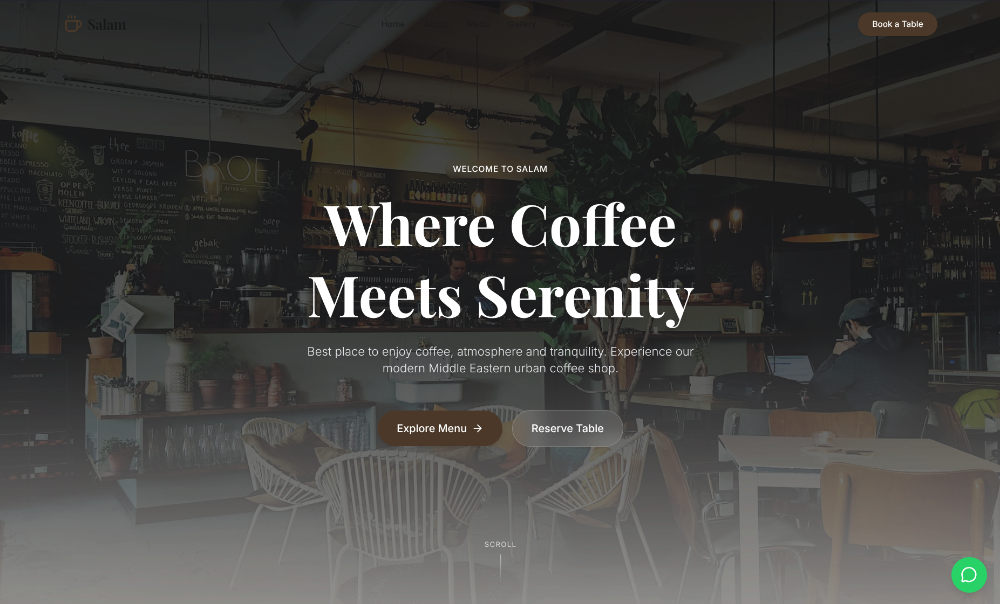
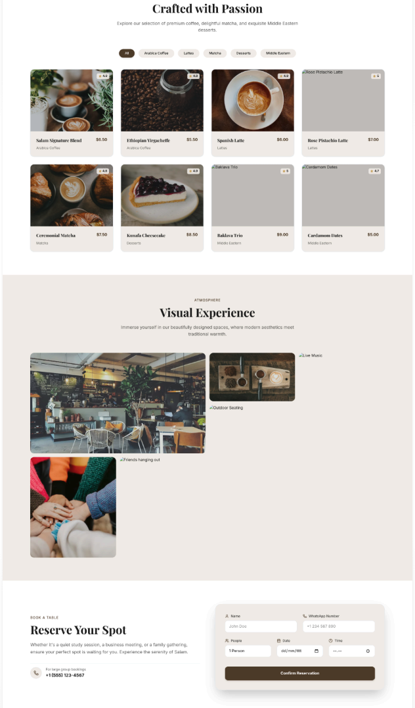

<div align="center">

<br />

<!-- LOGO / BANNER -->


<br />

**A modern, premium Islamic-modern cafe website built with Next.js 15, TailwindCSS v4, and Framer Motion.**

<br />

[](https://nextjs.org/)
[](https://react.dev/)
[](https://www.typescriptlang.org/)
[](https://tailwindcss.com/)
[](https://www.framer.com/motion/)
[](LICENSE)

<br />

[🌐 Live Demo](#) · [📖 Documentation](#table-of-contents) · [🐛 Report Bug](https://github.com/your-username/salam-cafe/issues) · [✨ Request Feature](https://github.com/your-username/salam-cafe/issues)

</div>

---

## 📸 Preview

<div align="center">

### 🏠 Hero Section — Cinematic First Impression


<br />

### 📋 Menu, Gallery & Reservation Sections


</div>

---

## 📚 Table of Contents

- [✨ Features](#-features)
- [🎨 Design System](#-design-system)
- [🏗️ Project Structure](#️-project-structure)
- [🚀 Tech Stack](#-tech-stack)
- [⚙️ Getting Started](#️-getting-started)
- [📦 Available Scripts](#-available-scripts)
- [🧩 Component Overview](#-component-overview)
- [🗺️ Page Sections](#️-page-sections)
- [🌙 Dark / Light Mode](#-dark--light-mode)
- [📱 Responsive Design](#-responsive-design)
- [🚢 Deployment](#-deployment)
- [🤝 Contributing](#-contributing)
- [📄 License](#-license)

---

## ✨ Features

- 🌟 **Premium Minimalist UI** — Inspired by modern high-end cafe brands worldwide
- ☕ **Islamic-Modern Aesthetic** — Warm earth tones, elegant typography, and refined visual elements
- ⚡ **Blazing Fast** — Built on Next.js 15 with App Router and Turbopack for optimal performance
- 🎞️ **Smooth Animations** — Framer Motion-powered micro-interactions, scroll animations, and entrance effects
- 🌙 **Dark & Light Mode** — Seamless theme switching with `next-themes`
- 📱 **Mobile First** — Fully responsive across all screen sizes
- 🔍 **SEO Ready** — Metadata, semantic HTML, and Open Graph configured out of the box
- 🍽️ **Interactive Menu** — Filterable menu categories with elegant card hover effects
- 📅 **Reservation System** — Validated booking form with animated success state
- 🖼️ **Masonry Gallery** — CSS Grid gallery with cinematic hover reveals
- 💬 **WhatsApp Integration** — Floating CTA button for direct customer communication
- 🎵 **Events & Promotions** — Premium cards for live music events and special promotions

---

## 🎨 Design System

### Color Palette

| Token | Light Mode | Dark Mode | Usage |
|:------|:----------:|:---------:|:------|
| `background` | `#EFEBE6` | `#0f0c09` | Page Background |
| `foreground` | `#111111` | `#f4f0ec` | Primary Text |
| `primary` | `#4A3623` | `#8b6b4a` | Coffee Brown — CTAs, Icons |
| `accent` | `#C5A059` | `#D4AF37` | Soft Gold — Highlights |
| `olive` | `#4A5D23` | `#6b8433` | Olive Green — Accents |
| `card` | `#ffffff` | `#1c1813` | Card Backgrounds |

### Typography

| Role | Font | Style |
|:-----|:-----|:------|
| **Headings** | [Playfair Display](https://fonts.google.com/specimen/Playfair+Display) | Serif, Bold, Elegant |
| **Body / UI** | [Inter](https://fonts.google.com/specimen/Inter) | Sans-serif, Clean, Modern |

---

## 🏗️ Project Structure

```
salam-cafe/
├── public/
│   └── preview/              # Documentation screenshots
│       ├── hero-preview.png
│       └── sections-preview.png
├── src/
│   ├── app/
│   │   ├── globals.css       # Design tokens & global styles
│   │   ├── layout.tsx        # Root layout with metadata & fonts
│   │   └── page.tsx          # Main page assembly
│   ├── components/
│   │   ├── Navbar.tsx        # Transparent→solid scroll-aware navigation
│   │   ├── Hero.tsx          # Fullscreen cinematic hero section
│   │   ├── About.tsx         # Cafe philosophy & statistics
│   │   ├── Menu.tsx          # Filterable menu with cards
│   │   ├── Gallery.tsx       # CSS Grid atmosphere gallery
│   │   ├── Reservation.tsx   # Table booking form
│   │   ├── Testimonials.tsx  # Auto-playing review carousel
│   │   ├── Events.tsx        # Events & promotions cards
│   │   ├── Footer.tsx        # Full footer with contact & hours
│   │   ├── WhatsAppButton.tsx# Floating WhatsApp CTA
│   │   └── theme-provider.tsx# next-themes wrapper
│   └── lib/
│       └── utils.ts          # cn() utility (clsx + tailwind-merge)
├── next.config.ts
├── tailwind.config.ts
├── tsconfig.json
└── package.json
```

---

## 🚀 Tech Stack

| Technology | Version | Purpose |
|:-----------|:-------:|:--------|
| [Next.js](https://nextjs.org/) | 16.2.6 | React framework, App Router, SSG |
| [React](https://react.dev/) | 19 | UI library |
| [TypeScript](https://www.typescriptlang.org/) | 5 | Type safety |
| [TailwindCSS](https://tailwindcss.com/) | v4 | Utility-first CSS with custom design tokens |
| [Framer Motion](https://www.framer.com/motion/) | 12 | Declarative animations & gestures |
| [next-themes](https://github.com/pacocoursey/next-themes) | 0.4 | Dark / Light mode management |
| [Lucide React](https://lucide.dev/) | 1.x | Modern icon library |
| [clsx](https://github.com/lukeed/clsx) + [tailwind-merge](https://github.com/dcastil/tailwind-merge) | latest | Conditional className management |

---

## ⚙️ Getting Started

### Prerequisites

Make sure you have the following installed:

- **Node.js** >= 18.x
- **npm** >= 9.x (or `yarn`, `pnpm`, `bun`)

### 1. Clone the Repository

```bash
git clone https://github.com/your-username/salam-cafe.git
cd salam-cafe
```

### 2. Install Dependencies

```bash
npm install
```

### 3. Run the Development Server

```bash
npm run dev
```

Open [http://localhost:3000](http://localhost:3000) in your browser. The page hot-reloads automatically as you edit files.

---

## 📦 Available Scripts

| Command | Description |
|:--------|:------------|
| `npm run dev` | Start development server with Turbopack |
| `npm run build` | Create optimized production build |
| `npm run start` | Start production server |
| `npm run lint` | Run ESLint code analysis |

---

## 🧩 Component Overview

### `<Navbar />`
A responsive navigation bar that starts fully **transparent** over the hero, then transitions to a **blurred glass background** when the user scrolls down. Includes a mobile hamburger menu with smooth animated expand/collapse.

### `<Hero />`
Fullscreen cinematic section with a high-quality background image, dark overlay gradient, and staggered **Framer Motion entrance animations**. Features two CTA buttons and a scroll indicator.

### `<About />`
Two-column layout showcasing the cafe's philosophy alongside a stacked image collage. Includes animated statistics (100% Premium Beans, 50k+ Happy Customers, 3 Cozy Spaces).

### `<Menu />`
Interactive menu with **category filter buttons**. Cards feature image zoom on hover, a star rating badge, and display the item's category and price. Uses `AnimatePresence` for smooth filter transitions.

### `<Gallery />`
A responsive CSS Grid masonry layout with **6 atmosphere photos**. Each card reveals a caption overlay on hover with smooth scale and opacity transitions.

### `<Reservation />`
A multi-field booking form (Name, WhatsApp, Guests, Date, Time) with HTML5 validation. On submission, it shows an **animated success confirmation** state with a checkmark icon.

### `<Testimonials />`
An **auto-playing carousel** (5-second interval) displaying customer reviews with avatars, star ratings, and manual dot navigation controls.

### `<Events />`
Premium event cards for live music nights, community discussions, and promotional offers, each with a category badge and event details.

### `<Footer />`
A 4-column footer with the Salam logo, quick links, contact info (address, phone, email), opening hours, and a social media CTA.

### `<WhatsAppButton />`
A fixed floating button in the bottom-right corner with a spring animation entrance, hover scale effect, and a tooltip "Chat with us" on hover.

---

## 🗺️ Page Sections

| # | Section | Component | Description |
|:--|:--------|:----------|:------------|
| 1 | **Hero** | `Hero.tsx` | Fullscreen cinematic intro with CTAs |
| 2 | **About** | `About.tsx` | Cafe philosophy & stats |
| 3 | **Menu** | `Menu.tsx` | Filterable premium menu |
| 4 | **Gallery** | `Gallery.tsx` | Masonry atmosphere grid |
| 5 | **Reservation** | `Reservation.tsx` | Table booking form |
| 6 | **Testimonials** | `Testimonials.tsx` | Auto-playing review carousel |
| 7 | **Events** | `Events.tsx` | Events & promotions |
| 8 | **Footer** | `Footer.tsx` | Contact, hours, social links |

---

## 🌙 Dark / Light Mode

The app defaults to **dark mode** and supports system preference detection via `next-themes`.

- Dark mode is the primary visual identity — rich coffee tones (`#0f0c09`, `#1c1813`) with gold accents.
- Light mode provides a clean beige-cream palette (`#EFEBE6`) suitable for daytime browsing.

All CSS color tokens are defined in `globals.css` under `.dark { }` and `:root { }` selectors.

---

## 📱 Responsive Design

The website is built **mobile-first** with breakpoints handled by TailwindCSS:

| Breakpoint | Width | Layout |
|:-----------|:-----:|:-------|
| `sm` | 640px+ | 2-column grid elements |
| `md` | 768px+ | 3-column menu grid, desktop navbar |
| `lg` | 1024px+ | 2-column About/Reservation layouts |
| `xl` | 1280px+ | Max-width container, optimized spacing |

---

## 🚢 Deployment

### Deploy on Vercel (Recommended)

The easiest way to deploy this Next.js app is via [Vercel](https://vercel.com/).

[](https://vercel.com/new/clone?repository-url=https://github.com/your-username/salam-cafe)

1. Push your code to GitHub.
2. Import the repository on [vercel.com/new](https://vercel.com/new).
3. Vercel auto-detects Next.js — click **Deploy**.

### Manual Build

```bash
npm run build
npm run start
```

---

## 🤝 Contributing

Contributions are welcome! If you'd like to improve the project:

1. **Fork** the repository
2. **Create** a feature branch: `git checkout -b feature/amazing-feature`
3. **Commit** your changes: `git commit -m 'feat: add amazing feature'`
4. **Push** to the branch: `git push origin feature/amazing-feature`
5. **Open** a Pull Request

Please follow [Conventional Commits](https://www.conventionalcommits.org/) for your commit messages.

---

## 📄 License

Distributed under the **MIT License**. See [`LICENSE`](LICENSE) for more information.

---

<div align="center">

Made with ❤️ and ☕ by the **Salam Cafe** team.

<br />

*"Where Coffee Meets Serenity"*

</div>
